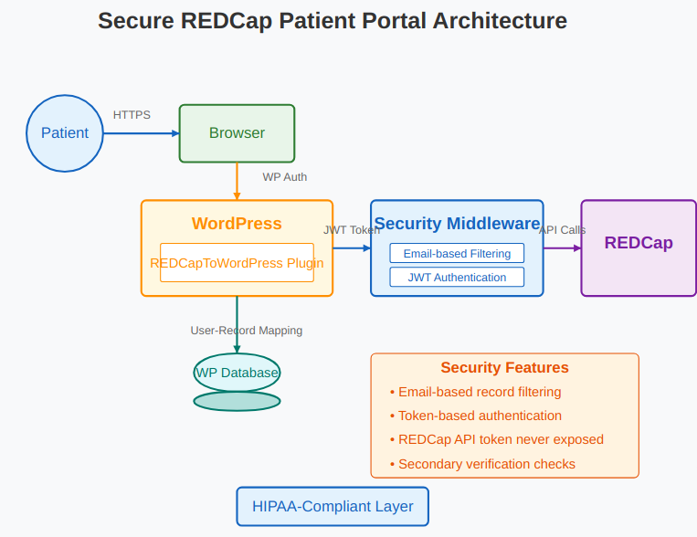
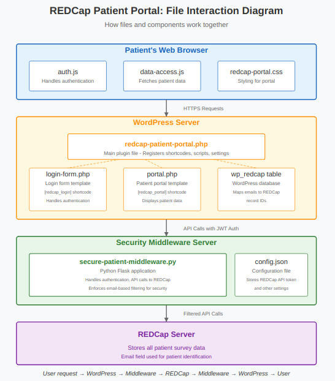
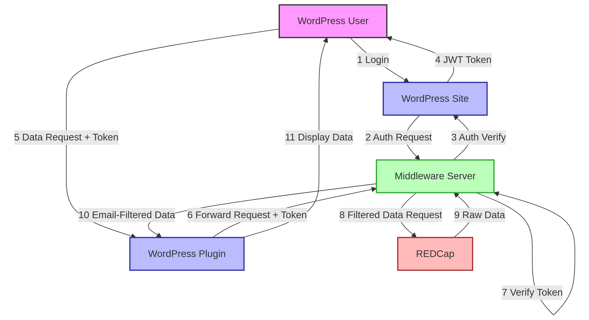

# REDCapToWordPress WordPress plugin

## Description
This plugin is designed to create a patient portal for medical or other research studies that are patient-driven, meaning that the study participant needs to enter data but also needs access to the data they input as well as study results that pertain to them. This links REDCap projects to WordPress websites, giving patients access to their personal data that they share with research projects.

## Plugin Structure
Folder structure of the plugin code basically follows Model-View-Controller (MVC) pattern:
- Model: `includes/` files handle data processing and storage
- View: `templates/` files generate the user interface
- Controller: `RedCap.php` and AJAX handlers that coordinate data flow

`REDCapToWordpress/REDCapToWordPress/Redcap.php` contains the main plugin file WordPress primary entry point. This file:
- Registers hooks and shortcodes
- Initializes the plugin
- Coordinates the interaction between components
  
`REDCapToWordpress/REDCapToWordPress/includes` contains files are incorporated into other files via PHP's require or include functions, rather than being loaded directly by WordPress. This directory contains:
- Business logic classes and functions
- Data processing utilities
- Authentication mechanisms
- API communication functions (like redcap_api_to_flask.php)

These files handle operations that should occur on the server-side of the WP plugin (not the middleware server) for security reasons. The middleware pattern (using `includes/redcap_api_to_flask.php`) ensures the REDCap API token never reaches the browser.

`REDCapToWordpress/REDCapToWordPress/js` contains client-side JavaScript that:
- Runs in the user's browser
- Handles user interactions
- Makes AJAX requests
- Updates the DOM based on responses

This code is separate from the code in the `/includes` folder as it executes in an entirely different environment (browser vs. server).

`REDCapToWordpress/REDCapToWordPress/templates` contains files that generate HTML output, thus separating presentation from logic. This adheres to the separation of concerns principle because:
- Visual representation should be isolated from data processing
- Templates can be modified without altering core functionality
- The same data can be presented in different ways

`REDCapToWordpress/REDCapToWordPress/css/` just contains styling information separated from structural HTML, following web development best practices.


### Pre-requisite plugins:
    
This plugin requires the [Native PHP Sessions for WordPress plugin](https://wordpress.org/plugins/wp-native-php-sessions/).
Be sure to install this before installing REDCapToWordPress.

## Setting up the Plugin
Download the REDCapToWordPress repository.

In the **config.json** file within the Middleware Server folder, add your REDCap API token and configure the middleware settings. More details on this are below.
 
Once all the changes are made, add the REDCapToWordPress folder to the plugins folder in WordPress. You can either directly upload the folder to your hosting server to  /htdocs/wp_content/plugins, or you can zip the `/REDCapToWordPress` folder and upload it through the admin backend view of WordPress.

### Creating landing pages

#### Login Page

This is the page where patients can login to access their data.

Create a page on your site with a URL like **yoursite.com/login**.

On this page, add the shortcode **[redcap_login redirect_url="/my-data"]**.

#### Patient Data Page

This is where patients can view their REDCap data. The current system is designed to
filter data by email address, ensuring patients can only see their own information.

Create a page on your site with a URL that matches your redirect_url (e.g., **yoursite.com/my-data**).

On this page, add the shortcode **[redcap_portal]**.

Create a page on your site for registering existing study participants to your wordpress site (e.g., **yoursite.com/registration**).

On this page, add the shortcode **[redcap_registration redirect="/my-data"]**

To display specific survey results (eg. on additional pages), use **[redcap_portal survey="survey_name"]**.

### Adding and Displaying Multiple Surveys in the REDCap Patient Portal

The REDCap Patient Portal allows you to display multiple survey results to users through a simple configuration system. This document explains how to add additional surveys to your portal implementation.

#### Basic Survey Display

Each survey can be displayed using the `[redcap_portal]` shortcode with a survey parameter:

```
[redcap_portal survey="medication_survey" show_profile="yes"]
```

Place this shortcode on any WordPress page where you want to show patient data from REDCap.

#### Multiple Survey Configuration Options

##### Option 1: Separate Pages

You can create multiple pages in WordPress, each with a different shortcode configuration:

1. Create a page for each survey (e.g., "Demographics", "Medications", "Follow-up")
2. Add the appropriate shortcode to each page:
   ```
   [redcap_portal survey="demographics"]
   [redcap_portal survey="medication_survey"]
   [redcap_portal survey="follow_up_survey"]
   ```
3. Create a menu in WordPress to link to these pages

##### Option 2: URL Parameters (Recommended)

For a more integrated experience, you can use a single page with URL parameters:

1. Create a single page (e.g., "My Data")
2. Add the basic shortcode: `[redcap_portal]`
3. Users can access different surveys via URLs:
   - `/my-data?survey=demographics`
   - `/my-data?survey=medication_survey`
   - `/my-data?survey=follow_up_survey`

##### Option 3: Tab-based Navigation

For a more interactive interface, you can add a tab navigation system:

1. Create a single page with the shortcode: `[redcap_portal]`
2. Add this HTML before the shortcode:
   ```html
   <div class="redcap-portal-nav">
       <ul>
           <li><a href="?survey=demographics">Demographics</a></li>
           <li><a href="?survey=medication_survey">Medications</a></li>
           <li><a href="?survey=follow_up_survey">Follow-ups</a></li>
       </ul>
   </div>
   ```
3. Add custom CSS to style the navigation tabs

#### Adding New Surveys to the Portal

To add a new survey to your portal:

1. **Identify the REDCap Survey Name**: Find the exact form/survey name in your REDCap project (e.g., `baseline_assessment`)

2. **Configure the Middleware**: Ensure your middleware is configured to serve data from this survey/form through the API

3. **Add the Survey to Your Portal**: Use one of the methods above to include the survey in your patient portal

4. **Test Access Control**: Verify that patients can only see their own data from the new survey

#### Customizing Survey Display

Each survey's display can be customized by:

1. Modifying the `portal.php` template file in the plugin's `templates` directory
2. Adding custom CSS to your theme to style specific survey elements
3. Using the survey name as a CSS class selector for targeted styling:
   ```css
   .redcap-survey-results[data-survey="medication_survey"] {
       /* Custom styling for medication survey */
   }
   ```

### Troubleshooting Survey Display

If a survey doesn't display properly:

1. Check your browser's developer console for JavaScript errors
2. Verify the survey name exactly matches the form name in REDCap
3. Confirm the middleware logs show successful requests for the survey data
4. Test if data exists for the current user in that specific survey

The portal is designed to gracefully handle missing data, displaying appropriate messages when no survey responses exist for the current user.

**Allowed survey names must also be specified in middleware config file at `/Middleman Server/config.json`**, refer to `/Middleman Server/config.json.example`.

## Building the Security Middleware

### Description and Rationale

Since this plugin is designed to work with REDCap, which is generally used to store 
Personal Health Information (PHI), we've implemented a robust security architecture.

Your REDCap study project will have an API you can activate to programmatically
access your study data. The issue is that REDCap only gives you one security token per user of 
your project that can be used to access your entire project. If a bad actor were to compromise your site and get a hold of your
token, they would have complete access to all your REDCap data.

Our solution uses a secure middleware server with:
1. Email-based filtering that ensures patients can only access their own data
2. JWT token authentication for secure sessions
3. Multiple layers of verification
4. The REDCap API token is never exposed to the client

A diagram of the information flow is shown below:





### Configuration

The Middleware Server code is located in the **Secure Middleware** folder (or **Middleman Server** folder if using original naming).

In the **config.json** file, add your institution's REDCap URL and 
add your study project's API token, along with other required settings:

```json
{
  "redcap_url": "https://your-redcap-instance.org/api/",
  "redcap_api_token": "YOUR_REDCAP_API_TOKEN",
  "jwt_secret": "GENERATE_A_SECURE_RANDOM_STRING",
  "wordpress_url": "https://your-wordpress-site.com",
  "allowed_origins": ["https://your-wordpress-site.com"]
}
```

The middleware is designed to filter data by email address. Make sure your REDCap project has an email field that can be used to identify patients.

The `REDCapToWordPress/config.ini` for the plugin logic should also be set to point to the middleware server.
(Currently, it assumes no authorization needed for connections, so you should either configure the firewall for the middleware server to only accept incoming connections from your wordpress site and REDCap site IPs (or range of IPs) or modify the code to use api keys for authenticating to the middleware server).

### Activating the middleware server

Upload the **Secure Middleware** folder to a server with appropriate security settings. It's recommended to:
1. Use IP restrictions to only accept connections from your WordPress server
2. Use HTTPS for all connections
3. Keep your config.json file secure and not web-accessible

To start the middleware:

```bash
# Install dependencies
pip install flask requests pyjwt

# For development
python secure-patient-middleware.py

# For production
gunicorn --bind 0.0.0.0:5000 secure-patient-middleware:app
```

For local testing (eg. before building, tagging, and pushing image to run container on AWS ECS or GCP Artifact Registry for running as a Cloud Run service), you can run...
```bash
cd ./Middleman\ Server
docker build -t wp2redcap_middleware
docker run -p 8080:8080 wp2redcap_middleware
```
... then some sanity testing to request and recieve something like...
```bash
$ curl http://localhost:8080/auth/wordpress -X POST -H "Content-Type: application/json" -d '{"username":"test","password":"test"}'
{"message": "Invalid credentials"}
```

## Security Model

The security model ensures patients can only access their own data through:

1. **Authentication**: Patients log in through WordPress
2. **Token-Based Sessions**: Secure JWT tokens manage sessions
3. **Email Filtering**: All REDCap queries are filtered by the patient's email
4. **Secondary Verification**: All returned data is double-checked to verify it belongs to the patient

## Data Mapping

Upon activation, the plugin creates a table for the wp site's DB called `wp_redcap` (or using whatever other prefix is specificed in the WP site's wp-config file) that maps WordPress user emails to REDCap record IDs:

```
+------------------+-------------+
| email            | record_id   |
+------------------+-------------+
| patient1@test.com| RECORD-001  |
| patient2@test.com| RECORD-002  |
+------------------+-------------+
```

## Troubleshooting

If patients cannot access their data:
1. Verify their WordPress email matches their REDCap email
2. Check the wp_redcap table mapping
3. Check middleware logs for errors
4. Verify your REDCap project has the necessary email field

For more detailed debugging:
1. In the WordPress admin, go to Settings > REDCap Portal
2. Enable "Show Debug Info" for administrators
3. Check the debug section when viewing the portal

## Security Best Practices

1. Use HTTPS for all connections
2. Regularly update both WordPress and the middleware
3. Use strong passwords and consider two-factor authentication
4. Regularly audit access logs
5. Consider IP restrictions for the middleware server


## ⚠️ IMPORTANT DISCLAIMER ⚠️

### HIPAA Compliance Notice

This software is provided as-is without any warranties or guarantees of HIPAA compliance. While best efforts have been made to implement security practices that align with HIPAA requirements:

- No formal HIPAA compliance audit has been performed on this codebase
- Implementation of this software does not automatically make your system HIPAA compliant
- The responsibility for ensuring HIPAA compliance rests with your organization
- You should conduct your own security assessment before using in production

### Security Limitations

The developer(s) of this software:

- Make no guarantees about the complete or reasonable cybersecurity of this system
- Are not liable for any data breaches or security incidents that may result from its use
- Recommend thorough testing and security auditing before implementation
- Cannot be held responsible for improper configuration or deployment

### Best Practices

If you intend to use this software with protected health information (PHI):

1. Have qualified security personnel review the codebase
2. Implement proper access controls and audit logging
3. Ensure secure network configuration and HTTPS
4. Consider a formal security assessment
5. Document your compliance measures
6. Maintain regular security updates

## Use At Your Own Risk

By using this software, you acknowledge that you understand these limitations and accept full responsibility for ensuring that your implementation meets all applicable security and regulatory requirements.

